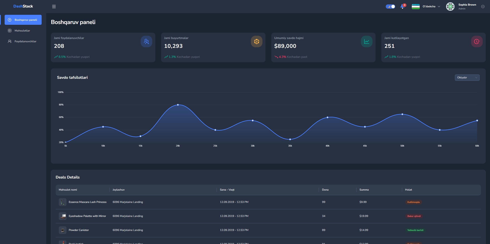

# 🚀 Modern Admin Dashboard (Nuxt 4)

Полноценная, готовая к продакшену Админ-панель, разработанная в рамках тестового задания.
Проект демонстрирует архитектурный подход уровня **Middle+ / Senior Frontend**, используя связку **Nuxt 4**, **TypeScript**, **Ant Design Vue** и **Tailwind CSS**.

В приложении реализованы полный цикл авторизации (включая Refresh Token), сложные CRUD операции, визуализация данных, а также полная адаптивность с поддержкой темной темы и мультиязычности.



## ✨ Ключевые возможности

### 🔐 Авторизация и Безопасность

- **JWT Authentication:** Полноценный вход через API DummyJSON.
- **Silent Refresh Token:** "Бесшовное" обновление токена через интерцепторы (обработка 401 ошибки) без разлогинивания пользователя.
- **Валидация сессии:** Проверка `/auth/me` при инициализации приложения для защиты от подмены.
- **Защита роутов:** Глобальный middleware для защиты приватных страниц.

### 📦 Модуль Продуктов (CRUD)

- **Продвинутая таблица:** Серверная пагинация, сортировка и поиск.
- **Сложная форма:** Создание/Редактирование продукта с 15+ полями, разделенными на логические секции (General, Pricing, Inventory, Shipping).
- **Валидация:** Строгая типизация и real-time валидация (через кастомные composables).

### 👥 Модуль Пользователей

- **Динамическая фильтрация:** Поиск, фильтры по Роли и Полу.
- **Управление статусом:** Переключение статуса (Active/Inactive) прямо в таблице.
- **Кастомные компоненты:** Умные инпуты (например, авто-форматирование телефона для Узбекистана `+998`).

### 🎨 UI/UX и Темизация

- **Дизайн-система:** Гибрид **Ant Design Vue** (для сложной логики) и **Tailwind CSS** (для верстки и стилизации).
- **Dark/Light Mode:** Полная поддержка переключения тем с сохранением выбора (Pinia + Cookies).
- **Локализация (i18n):** Поддержка 3 языков: **English**, **Русский**, **O'zbekcha** (переведены интерфейс, ошибки валидации и контент таблиц).
- **Адаптивность:** Дизайн со сворачиваемым сайдбаром и выезжающим меню (Drawer) на мобильных устройствах.

### 📊 Дашборд

- **Визуализация:** Интерактивные графики на **Chart.js** с градиентами.
- **Статистика:** Агрегация данных с нескольких эндпоинтов.

---

## 🛠 Технический стек

- **Фреймворк:** [Nuxt 4](https://nuxt.com/) (Latest)
- **Язык:** TypeScript
- **UI Фреймворк:** [Ant Design Vue](https://antdv.com/)
- **Стилизация:** Tailwind CSS (настроен для работы без конфликтов с AntD)
- **Управление состоянием:** Pinia + `pinia-plugin-persistedstate`
- **Работа с API:** Нативный `$fetch` с кастомной оберткой-интерцептором (`useApi`)
- **Локализация:** `@nuxtjs/i18n`
- **Графики:** Chart.js + vue-chartjs

---

## 📂 Структура проекта

Проект следует принципам Domain-Driven Design (DDD) для удобства поддержки и масштабирования:

```bash
...
├── components/
│   ├── common/          # Переиспользуемые UI компоненты (PhoneInput, Breadcrumbs)
│   ├── dashboard/       # Виджеты дашборда (StatCard, SalesChart)
│   ├── layout/          # Логика Layout (Sidebar, Header, Drawer)
│   ├── product/         # Таблицы и секции форм продуктов
│   └── user/            # Таблицы и секции форм пользователей
├── composables/
│   ├── useApi.ts        # Обертка над useFetch с обработкой ошибок и токенов
│   ├── useAuth.ts       # Логика авторизации
│   ├── useProducts.ts   # Бизнес-логика продуктов (CRUD)
│   └── useUsers.ts      # Бизнес-логика пользователей (CRUD)
│   └── useFormRules.ts  # Централизованные правила валидации
│   └── ...
├── i18n/                # Файлы переводов (en, ru, uz)
├── stores/              # Pinia хранилища (Auth, Theme, UI)
├── pages/               # Файловый роутинг
└── middleware/          # Защита роутов
```

## 🚀 Установка и Запуск

Перед началом убедитесь, что у вас установлен **Node.js** (версия 18+).

### 1. Клонирование репозитория

```bash
git clone https://github.com/AzamatIsakov/admin-panel.git
cd admin-panel
```

### 2. Установка зависимостей

Используйте npm:

```bash
npm install
```

### 3. Запуск в режиме разработки

Запустит локальный сервер с горячей перезагрузкой (HMR):

```bash
npm run dev
```

Откройте браузер по адресу: http://localhost:3000

### 4. Сборка для продакшена

Для создания оптимизированной сборки:

```bash
npm run build
npm run preview # Предпросмотр собранной версии
```

## 🧪 Тестовые данные (DummyJSON)

Для входа используйте учетные данные любого пользователя из DummyJSON, например:

- Username: **_emilys_**
- Password: **_emilyspass_**

### Автор

Разработано — **Azamat Isakov**
